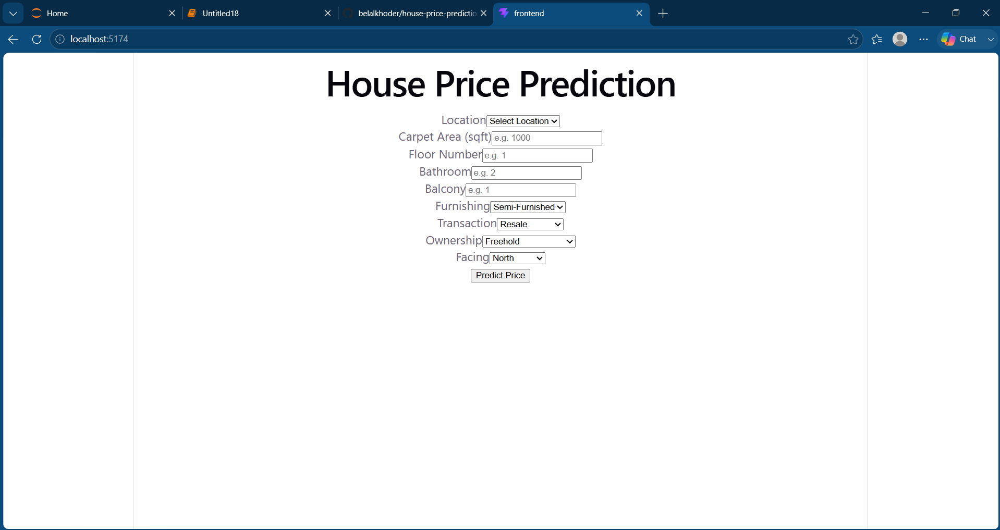
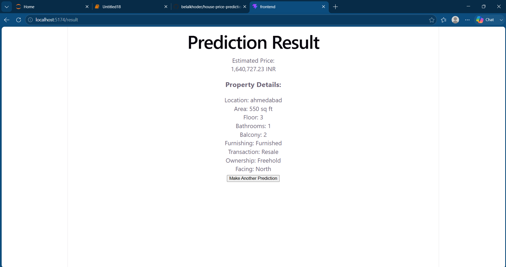

# House Price Prediction

##  Overview
A full-stack machine learning web application designed to predict house prices in india. This project integrates a backend built with FastAPI, a frontend using React and TypeScript, and leverages two powerful machine learning models like Gradient Boosting Regressor and a Linear Regression model  

##  Architecture Diagram
```text
[ React + TypeScript (Frontend) ] 
         | 
  (REST API / JSON) 
         |
    [ FastAPI (Backend) ]
         |
   +-----+-----+
   |           |
[ GBR ]     [ linear ]  (Machine Learning Models)
```

##  Tech Stack
- **Frontend:** React, TypeScript, HTML/CSS
- **Backend:** FastAPI, Python, Uvicorn
- **Machine Learning:** Scikit-Learn (Gradient Boosting Regressor,linear regression)
- **Data Processing:** Pandas, NumPy, StandardScaler

##  Project Structure
```text
house-price-prediction-app/
├── backend/
│   ├── main.py              # FastAPI application
│   ├── model.pkl            # Trained ML model (must be < 50MB)
│   ├── requirements.txt     # Python dependencies
│   └── .env                 # Backend environment variables
├── frontend/
│   ├── src/                 # React components and logic
│   ├── package.json         # Node dependencies
│   └── .env                 # Frontend environment variables
├── dataset/                 # (Excluded via .gitignore)
│   └── raw_data.csv         # Downloaded dataset
├── notebooks/
│   └── model_training.ipynb # Jupyter notebook for EDA and model training
├── .gitignore
└── README.md
```

##  Dataset Link & Download Instructions
**Note:** The raw dataset CSV is excluded from version control due to its large size.
1. Download the dataset from: `https://www.kaggle.com/datasets/juhibhojani/house-price`
2. Extract the file and rename it to `raw_data.csv` (if necessary).
3. Place the file inside the `dataset/` directory at the root of the project.

##  Setup Steps

### 1. Backend Setup
```bash
cd backend
# Create a virtual environment (or use your existing Anaconda env)
python -m venv .venv
# Activate the environment
# Windows: .venv\Scripts\activate | Mac/Linux: source .venv/bin/activate
pip install -r requirements.txt
uvicorn main:app --reload
```
*The API will be available at `http://127.0.0.1:8000`*

### 2. Frontend Setup
```bash
cd frontend
npm install
npm run dev
```
*The web app will run on `http://localhost:5173/`*

##  Environment Variables

### Backend `.env`
| Variable | Description | Example |
|---|---|---|
| `MODEL_PATH` | Path to the `.pkl` model file | `./model.pkl` |
| `PORT` | API Port | `8000` |

### Frontend `.env`
| Variable | Description | Example |
|---|---|---|
| `VITE_API_URL` | The base URL of the FastAPI backend | `http://127.0.0.1:8000` |

## 🔌 API Reference
**Endpoint:** `POST /predict`

**Description:** Accepts house features and returns the predicted price.

**cURL Example:**
```bash
curl -X 'POST' \
'http://127.0.0.1:8000/api/predict' \
  -H 'accept: application/json' \
  -H 'Content-Type: application/json' \
  -d '{
  "location": "Downtown",
  "carpet_area_sqft": 1200.5,
  "floor_num": 3,
  "bathroom": 2,
  "balcony": 1,
  "furnishing": "Semi-Furnished",
  "transaction": "Resale",
  "ownership": "Freehold",
  "facing": "East"
}'
```


##  Model Metrics
Here are the evaluation metrics for the chosen prediction model:
* **MAE (Mean Absolute Error):** `2373699.67`
* **R² (R-Squared):** `0.857348`
* **RMSE (Root_Mean_Squared_Error):** `4554436.78`
##  Screenshots


